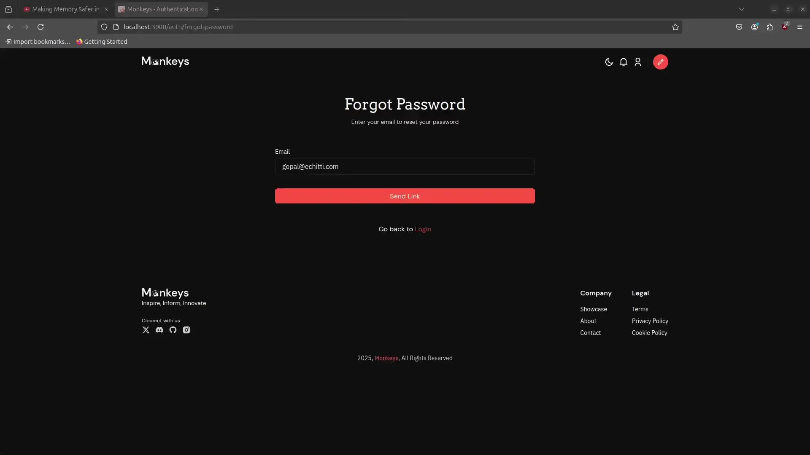
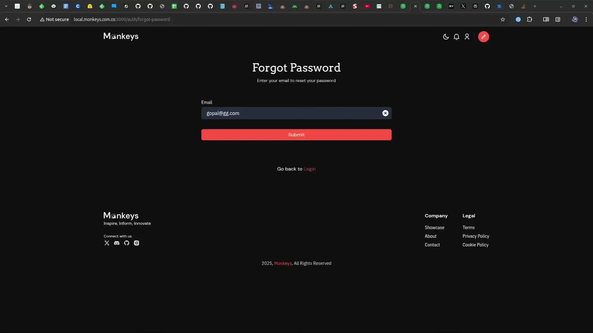
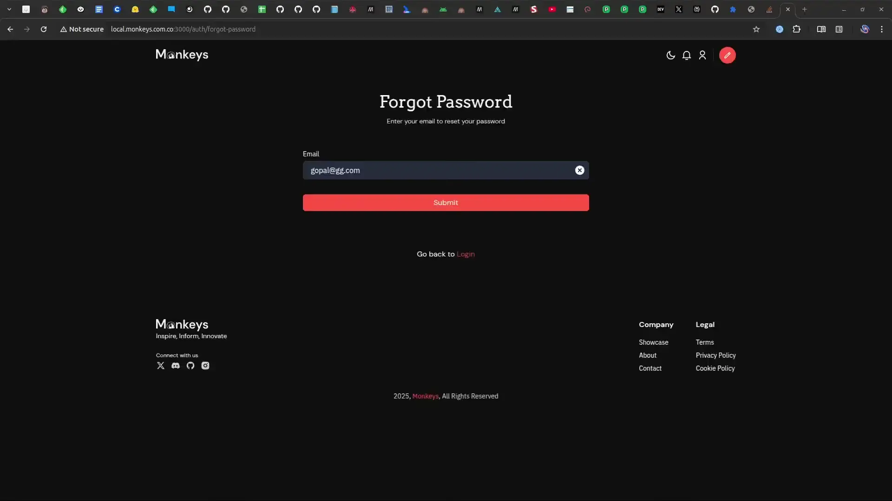

## Introduction
I have a bad habit of stopping in middle of a task and step out in thinking mode. It has both worked as a power-up and a kryptonite. 

One such task was this simple page with a forgot password that I was developing for [Monkeys](https://monkeys.com.co). A fairly simple task a form with one field nothing odd about it. 

Here's a small preview of the page.


I regret not writing this blog earlier, if I did I would have known what led me to this adventure, the adventure I am writing in this blog.

The gif is of a user with email gopal@echitti.com using the forgot password page, to send the link for resetting the password.
There's nothing wrong in the gif, the user types their email, clicks on send and a toast pops up alerting the user that the link has been sent successfully.

## The toast
Suddenly something popped in my head and I starting reflecting back on the whole transaction the user had.

It was the toast, as the title makes it obvious. 

Toast is a fairly common component which is often used to display a message or sometimes feedback of an action on the screen. 
A more formal definition by https://web.dev state is this way:

> Toasts are non-interactive, passive, and asynchronous short messages for users. Generally they are used as an interface feedback pattern for informing the user about the results of an action.
> - https://web.dev/articles/building/a-toast-component

`output` tag is not necessarily used, but if you care about HTML semantics and A11Y (specifically the WCAG).

When I tested our toast using [Chrome Vox extension](https://chromewebstore.google.com/detail/screen-reader/kgejglhpjiefppelpmljglcjbhoiplfn) to test our application for screen readers, it worked well. The toast message would announce itself promptly as it would show up.

Something still looked out of place a bit and the page felt incomplete. As I pondered more about it, I started reading and found some good articles that clarified a lot for me.
## Toasts can be missed
Speaking metaphorically and literally, toasts are meant to be consumed, missing one might lead you to stay hungry for your breakfast or in our context hungry for feedback or the message that was contained in the toast.

Let's say our user, after submitting the form got interrupted by something which took their attention away from the screen, and in that meanwhile the toast appeared and then disappeared.
When the user gets their attention back they won't have any conclusion of their action. The Doorway Effect is an even worse enemy here, the user may completely forget if they clicked the button at all.

I call things like these smell, and when a lot of smell accumulates the application becomes smelly. This makes your app uninviting and less of an incentive, this makes you rely more on business and marketing.

## Smells of toast
In the blog [Defining 'Toasts' Message](https://adrianroselli.com/2020/01/defining-toast-messages.html), [Adrian](https://adrianroselli.com/) gives a more in-depth rundown of smells in the context of accessibility.

A quote from the blog.
> "By their very nature, toasts are likely to fail a WCAG audit right out of the gate if some effort is not made from the start. Following are WCAG 2.1 Success Criteria you should keep in mind when building your own or testing one of the existing options."

Here's a list of rules that our page probably violates.
1. [Timing adjustable (2.2.1)](https://www.w3.org/WAI/WCAG21/Understanding/timing-adjustable.html)
2. [Content Hover on focus (1.4.13)](https://www.w3.org/WAI/WCAG21/Understanding/content-on-hover-or-focus.html)
3. [Target size (2.5.5)](https://www.w3.org/WAI/WCAG21/Understanding/target-size.html)

When developing components we often forget about how different users access different parts of the web. While WCAG is treated as a dense manual it can bring interesting insights on how components are used or at least how they are naturally perceived to be used.

Speaking in another way WCAG is more of an engineering manual. While software development especially frontend development is treated as a creative endeavor, WCAG is an engineering guide to that creative endavour.

Think of it like making a car, while you can make a car look cool and futuristic, if raising the blinker lever and actual direction the blinkers blink is inverted then it's a bad design overall.

Similarly the [Content Hover on focus (1.4.13)](https://www.w3.org/WAI/WCAG21/Understanding/content-on-hover-or-focus.html) is a real bummer, no amount of observability, user events tracking can save you from this. Users would press `Esc` and instead of toast closing an another element like a tooltip may close and this will leave them a lot frustrated.

## Solution
Let's solve the problem in our page and start by breaking down our problem 

1. Success
	- It is redundant for user to submit the form again on success. So our message can't be short-lived, as toasts are easy to miss.
	- We also cannot permanently disable the 'submit' button, cause the user can change the input and would like to submit again.
2. Error - Validation errors
	- Validation errors are straightforward and we don't need to change anything for them, the existing one works great.
3. Error - Submit
	- Submission errors are rare and can only occur from server's end, so they are a special scenario.
	- So we want to prompt our user to contact support if they face such an anomaly, or provide an option to retry submitting.

### Utilizing our button
Our button is the first point of interaction here, and we're already dynamically showing a loader on the button. We're wasting a lot of potential as this dynamic element can be utilized to do much more.

Let's start by incorporating our button with a success and a failure state.

```diff
export function ForgotPasswordForm() {
	const [loading, setLoading] = useState(false);
+   const [isSuccess, setIsSuccess] = useState(false);
+   const [isError, setIsError] = useState(false);
}

...

function handleSubmt() {
	try {
		//...
+       setIsSuccess(true);
+       setIsError(false);
	} catch (err) {
		//...
+		setIsError(true);
+       setIsSuccess(true);
	} finally {
		setLoading(false);
	}
}
```

Our button can now have different text based on the state we added earlier.
```diff
<button
-   disabled={loading}
+	disabled={loading || isSuccess}
>
+  {!isError && !isSuccess && 'Submit'}
+  {!isError && 'Click to Retry'}
+  {!isSuccess && 'Submitted Successfully'}
</button>
```
We disable the button on success because we don't want the user to send again and again as it is redundant.

Since we're disabling the button on success, we should also add some way to reset the state. So that the user doesn't have to refresh the page to enter another input.

I went with a button to clear the input, which will also reset the success state.

```diff

const handleChange = () => {
+ if (isSuccess) setIsSuccess(false);

//...
}

+const handleClear = (e) => {
    //....
+   setIsSuccess(false);
+}

//...
<label>Email</label>
<input type="email" onChange={handleChange} />
+<button onClick={handleClear} aria-label='clear button'>X</button>

```

With this we ensured the user has a way to reset the input.

Finally to display the error message, we can use our existing toast. Or we can just show a error text on the form.

The final result looks like this

**Success Case**


**Error Case**


## Conclusion
While design needs to be visible, bold and generate a brand; UX on the other hand needs to be as hidden as possible.
A good UX should comes in the way of user and feels much more natural. It is always the small details that whiff out and causes smell in the UX and when these smell accumulates the UX becomes smelly and the product becomes uninviting.
By no means I want to convey that toasts are bad, our eyes are often deceiving, just by hiding the toast or looking beyond it the underlying problems looks more clearer.

## References
- https://web.dev/articles/building/a-toast-component
- https://adrianroselli.com/2020/01/defining-toast-messages.html
