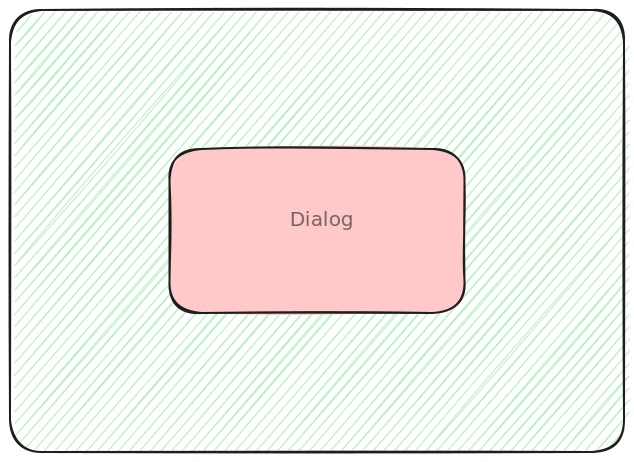

## Motivation 
As the title suggests this blog is about building popovers using a dialog tag. But why you may ask. Well I had to create one, and since tooling popover api was not ready, it also wasn't in the option too.

### Why not use a component library?

Don't get me wrong, component libraries are great and bring a lot of conveiniance for developing such complex elements, but I am not the fan of the bloat that comes along with it. To make the component library generic and re-usable, many component libraries re-write the logic on their own in javascript, which is likely present in some browser's native tag itself.
Surely there are some native components that no one likes and are not a suitable replacement for the common component patterns often used in application design, yes I am looking at the select tag.
But others like dialog, provide a good enough abstraction and ability of modification that made the whole idea worth a try.

When it comes to component like popover and dialog, it's a bit tedious to create different parts that complements them. For them, you need a backdrop and when the backdrop is clicked the component may or may not dismiss; handle event propagation and the annoying pointer events if your component is a nested popover.

Dialog tag had a backdrop built in, so it can saved me lot of effort of positioning the backdrop and handle event propagations. The only thing remaining would be just positioning.

## The code
Here's how I made it, roughly. If you want a step by step explanation, then you can follow up here. If you can understand the code here's the [codepen](https://codepen.io/Tanishq/pen/YPzagxY) for it.

```html
<!-- html file -->
<header>
    <p>Logo</p>
    <div>
        <button id='trigger'>Trigger</button>
        <dialog>
            <div class="dialog-content">
                <button>Profile</button>
                <button>Logout</button>
            </div>
        </dialog>
    </div>
</header>
```

```css
/* css file */
header {
  background: gold;
  display: flex;
  justify-content: space-between;
  align-items: center;
}

.dialog-content {
  display: flex;
  flex-flow: column;
  gap: 16px;
}

dialog::backdrop {
  opacity: 0;
}
```

```js
// js file
const dialog = document.querySelector('dialog');
const trigger = document.querySelector('#trigger');

trigger.addEventListener('click', () => dialog.showModal());

```

Here's a boilerplate to get started with the example, it contains a trigger to show the dialog and the backdrop is made transparent purposefully since we're making a popover.

### Dismiss dialog when backdrop is clicked

Since backdrop of a `<dialog>` is a pseudo element, there is no way to add an event listener to it, that distinguishes it from the dialog. The recommended way is to check if the mouse is inside the dialog or not. 



This is fairly easy in javascript, as for mouse events javascript provides us with the exact coordinates of the mouse. Similarly javascript can also get us the coordinates for each of the side our dialog.

To summarize, we'll calculate if the click event is left of left side of dialog, top of top side of dialog etc. that click is outside the dialog and we close it. 

```js
...

dialog.addEventListener('click', (event) => {
    const dialogRect = dialog.getBoundingClientRect(); 

    if (
    event.clientX <= dialogRect.left || event.clientX >= dialogRect.right
    || event.clientY <=dialogRect.top || event.clientY >= dialogRect.bottom
    ) {
        dialog.close();
    }
});

```

### Positioning the dialog

Dialogs are centered using margins, so we need to reset the margin, so that we can apply `left` and `top` attributes to position.

```css
dialog {
  margin: 0;
}
```

After applying `margin: 0` we can position the component using position attributes (top, left, right bottom).

### Anchoring the dialog to trigger

The last bit of effort that remains is to anchor our dialog to the trigger. To do this we can get the coords for button and manipulate the dialogs position attributes.

```js
const triggerRect = trigger.getBoundingClientRect();

dialog.style.left = triggerRect.left + 'px';
dialog.style.top = triggerRect.bottom + 'px';
```

Since our popover will open below the trigger the top is set to trigger's bottom.

### Dynamic positioning
Our popover is neatly positioned below the trigger, but there are 2 problems, the visible one is that our popover is overflowing outside, but the more important one is that the position is static.

This is troublesome as our position of the popover would be dependent on the coords in the first render 

#### Using percentages
One workaround that seems obvious is to use percentages as units instead of hardcore `px`. So our solution looks like this.

```js
dialog.style.left = (100 * triggerRect.left / document.body.clientWidth) + "%"; 
dialog.style.top = (100 * triggerRect.left / document.documentElement.clientWidth) + "%"; 
```
Now when we resize our window the popover moves along.

#### Using ResizeObserver
If you play around window resizing a bit, it becomes clear that the percentages are not precise and uniformly applied like the pixels.

It seems clear there is no clear workaround to avoid using pixels. Luckily in javascript we have an interface called `ResizeObserver` which triggers a callback whenever the element it is observing changes it's dimension.

Using `ResizeObserver` our code looks like this.

```js
const observer = new ResizeObserver((entries) => {
    const triggerRect = trigger.getBoundingClientRect();

    dialog.style.left = triggerRect.left + 'px';
    dialog.style.top = triggerRect.bottom + 'px';   
})

observer.observe(document.body)
```

Now when you'll resize the window the component will be stuck to where it supposed to be. And since this is made from a dialog, we've all the a11y feature like dismissing using `Esc` etc. by default.

To tidy up let's add take care of the visible issue.
```js
dialog.style.transform = 'translateX(-50%)';
```
